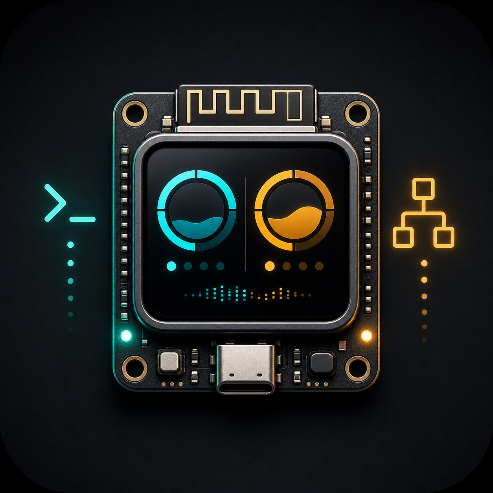

# ESP32 Token Meter

<p align="center">
  
</p>

<p align="center">
  <a href="README.md">English README</a>
</p>


Dashboard local de tokens e limites para ESP32 com display TFT touch de 2.8 polegadas. O firmware mostra uso local do Codex e status do Claude Code consultando uma bridge HTTP local rodando no computador.

A ESP32 não chama diretamente APIs da OpenAI, Anthropic, Codex ou Claude. Contas pessoais de Codex e Claude Code não expõem uma API pública completa de uso individual, então o projeto lê fontes locais:

- Codex: tokens lidos de `~/.codex/state_5.sqlite`.
- Claude Code: histórico local de sessões e saída do `statusLine` gravada em `server/claude_status.json`.
- ESP32: cliente Wi-Fi que consulta os endpoints da bridge e renderiza os valores com LVGL.

## Funcionalidades

- Firmware para placa ESP32-2432S028R / CYD com TFT 240x320.
- Bridge Python local com `/api/codex`, `/api/claude`, `/api/summary` e `/api/health`.
- Leitor do banco SQLite local do Codex.
- Leitor de histórico local JSON/JSONL do Claude Code.
- Instalador do `statusLine` do Claude Code para status de 5 horas / 7 dias quando disponível.
- Intervalo de atualização, URLs da bridge e limites manuais configuráveis.
- Botão touch de atualização na tela.

## Componentes Utilizados

Hardware recomendado:

- Placa ESP32-2432S028R / CYD, ou equivalente.
- Display TFT 2.8 polegadas 240x320 com driver ILI9341.
- Controlador touch resistivo XPT2046.
- Módulo ESP32 com Wi-Fi.
- Cabo USB para alimentação, gravação e monitor serial.
- PC Windows rodando a bridge local.
- Driver USB serial opcional, como CH340, dependendo da placa.

Link de compra da placa usada neste projeto:

- [Placa de Desenvolvimento ESP32 LVGL WIFI&Bluetooth com Tela Inteligente de 2.8" 240x320, Módulo LCD TFT de 2.8 polegadas com Toque](https://s.click.aliexpress.com/e/_c2z5DW13)

Confira o anúncio, pinagem, driver do display e controlador touch antes de comprar, porque placas ESP32 com tela parecidas podem usar ligações diferentes.

Suporte impresso opcional:

- [Bongo Cat Mini Monitor Animated ESP32 Display no MakerWorld](https://makerworld.com/pt/models/1654522-bongo-cat-mini-monitor-animated-esp32-display?from=search#profileId-1749680)

Confira a página do modelo no MakerWorld para arquivos de impressão, encaixe, licença, atribuição e regras de remix antes de imprimir ou compartilhar peças modificadas.

## Stack de Software

- PlatformIO
- Arduino framework para ESP32
- LVGL 8.4
- TFT_eSPI
- ArduinoJson
- Servidor HTTP local com Python 3
- Script PowerShell para o `statusLine` do Claude Code

## Estrutura do Projeto

```text
.
+- src/
|  +- main.cpp              # Firmware ESP32, UI LVGL, Wi-Fi e HTTP
|  +- logo_assets.c         # Assets LVGL gerados
+- imgs/
|  +- project-logo.png      # Logo do projeto gerada por IA
|  +- codex.png
|  +- claudecode.png
+- include/
|  +- config.h              # Defaults e hook de override local
|  +- config.example.h
|  +- lv_conf.h
+- scripts/
|  +- load_env.py           # Injeta .env no build PlatformIO
|  +- install_claude_statusline.py
|  +- claude_statusline.ps1
|  +- generate_logo_assets.py
+- server/
|  +- run_server.py         # Bridge HTTP local
|  +- config.example.json
+- platformio.ini
+- README.md
+- README.pt-BR.md
```

Arquivos locais ignorados pelo Git:

```text
.env
.pio/
.vscode/
server/config.json
server/claude_status.json
include/config.local.h
__pycache__/
*.pyc
```

## Requisitos

- Windows com PowerShell.
- Python 3.
- PlatformIO CLI ou extensão PlatformIO no VS Code.
- Claude Code instalado e autenticado.
- Codex usado na mesma máquina, para existir `~/.codex/state_5.sqlite`.
- Placa ESP32-2432S028R / CYD ou pinagem compatível.

Verificações rápidas:

```powershell
py -3 --version
& $env:USERPROFILE\.platformio\penv\Scripts\platformio.exe --version
```

Se o PlatformIO não estiver instalado, instale pela extensão do VS Code ou pelo Python:

```powershell
py -3 -m pip install platformio
```

## 1. Instalar o Claude Code

Instale o Claude Code:

```powershell
irm https://claude.ai/install.ps1 | iex
```

Se o instalador avisar que `C:\Users\SEU_USUARIO\.local\bin` não está no `PATH`, adicione:

```powershell
$claudeBin = Join-Path $env:USERPROFILE ".local\bin"
$userPath = [Environment]::GetEnvironmentVariable("Path", "User")
if (($userPath -split ";") -notcontains $claudeBin) {
  [Environment]::SetEnvironmentVariable("Path", "$userPath;$claudeBin", "User")
}
$env:Path += ";$claudeBin"
```

Teste:

```powershell
claude --version
claude
```

Não rode o Claude Code com `--bare` ou `--safe-mode` para este projeto, porque esses modos podem ignorar customizações como `statusLine`.

## 2. Configurar o StatusLine do Claude Code

Na raiz do projeto:

```powershell
cd C:\Users\SEU_USUARIO\Documents\codes\codex-claude-project
py -3 scripts\install_claude_statusline.py
```

O instalador atualiza:

```text
C:\Users\SEU_USUARIO\.claude\settings.json
```

Ele instala um comando parecido com:

```powershell
powershell.exe -NoProfile -ExecutionPolicy Bypass -File "...\scripts\claude_statusline.ps1"
```

Abra o Claude Code normalmente e envie qualquer mensagem. Depois verifique se o arquivo local de status existe:

```powershell
Test-Path .\server\claude_status.json
Get-Content .\server\claude_status.json
```

Se ele não existir, reinicie o terminal, rode `claude`, envie uma mensagem simples e rode o instalador novamente se necessário.

## 3. Configurar o Ambiente do Firmware

Crie um arquivo local `.env` na raiz do projeto. Não faça commit desse arquivo.

Exemplo:

```env
WIFI_SSID=sua-rede
WIFI_PASSWORD=sua-senha

CODEX_BRIDGE_URL=http://192.168.1.50:8787/api/codex
CLAUDE_BRIDGE_URL=http://192.168.1.50:8787/api/claude

USE_CODEX=1
USE_CLAUDE=1

USAGE_WINDOW_DAYS=7
REFRESH_INTERVAL_MS=5000

CODEX_TOKEN_LIMIT=0
CLAUDE_TOKEN_LIMIT=0

DEVICE_NAME=TokenMeter
```

Use o IPv4 do computador que está rodando a bridge. Não use `localhost` no firmware da ESP32, porque `localhost` apontaria para a própria ESP32.

Descubra o IP do PC:

```powershell
ipconfig
```

O `.env` é carregado por `scripts/load_env.py` durante o build do PlatformIO. Sempre recompile e suba o firmware depois de alterar o `.env`.

## 4. Rodar a Bridge Local

Inicie a bridge:

```powershell
py -3 server\run_server.py
```

Ela escuta em:

```text
http://0.0.0.0:8787
```

Endpoints:

```text
http://localhost:8787/api/codex
http://localhost:8787/api/claude
http://localhost:8787/api/summary
http://localhost:8787/api/health
```

Teste local:

```powershell
irm http://localhost:8787/api/codex
irm http://localhost:8787/api/claude
irm http://localhost:8787/api/summary
```

Teste pelo IP usado pela ESP32:

```powershell
irm http://192.168.1.50:8787/api/summary
```

Se `localhost` funciona, mas o IP da rede não funciona, verifique o Firewall do Windows e confirme que a ESP32 e o PC estão na mesma rede.

Rodar em background:

```powershell
Start-Process -WindowStyle Hidden -FilePath py -ArgumentList @("-3", "server\run_server.py") -WorkingDirectory (Get-Location)
```

Parar bridges duplicadas:

```powershell
Get-CimInstance Win32_Process |
  Where-Object { $_.CommandLine -match "run_server.py" } |
  ForEach-Object { Stop-Process -Id $_.ProcessId -Force }
```

## 5. Dados do Codex

Por padrão o servidor lê:

```text
C:\Users\SEU_USUARIO\.codex\state_5.sqlite
```

Resposta saudável esperada:

```powershell
irm http://localhost:8787/api/codex
```

```json
{
  "id": "codex",
  "available": true,
  "status": "ok",
  "tokens_used": 123456
}
```

Se o Codex nunca foi usado nessa máquina, o endpoint pode retornar sem dados locais.

## 6. Dados do Claude Code

O Claude Code grava status ao vivo em:

```text
server/claude_status.json
```

A bridge também varre o histórico local em:

```text
C:\Users\SEU_USUARIO\.claude\projects
C:\Users\SEU_USUARIO\.claude\sessions
```

Resposta saudável esperada:

```powershell
irm http://localhost:8787/api/claude
```

```json
{
  "id": "claude",
  "available": true,
  "status": "5h",
  "display_value": "2%",
  "percent_used": 2,
  "limit_label": "5h reset 06:10"
}
```

Se aparecer `available: false` ou `sem dados`, gere uma nova resposta no Claude Code e confira `server/claude_status.json`.

## 7. Configuração Manual Opcional do Server

Copie o exemplo apenas se precisar sobrescrever caminhos ou valores:

```powershell
Copy-Item server\config.example.json server\config.json
```

Exemplo de status manual para Claude:

```json
{
  "bind": "0.0.0.0",
  "port": 8787,
  "providers": {
    "claude": {
      "enabled": true,
      "percent_used": 62,
      "display_value": "62%",
      "limit_label": "5h reset 18:00",
      "status": "manual"
    }
  },
  "paths": {
    "codex_state_db": null,
    "claude_status_json": null
  }
}
```

`server/config.json` é ignorado pelo Git.

## 8. Build e Upload

Build:

```powershell
& $env:USERPROFILE\.platformio\penv\Scripts\platformio.exe run -e esp32-2432S028R
```

Listar portas seriais:

```powershell
& $env:USERPROFILE\.platformio\penv\Scripts\platformio.exe device list
```

Upload:

```powershell
& $env:USERPROFILE\.platformio\penv\Scripts\platformio.exe run -e esp32-2432S028R -t upload --upload-port COM4
```

Monitor serial:

```powershell
& $env:USERPROFILE\.platformio\penv\Scripts\platformio.exe device monitor -b 115200 --port COM4
```

Se o upload falhar com erro de boot mode:

1. Segure `BOOT`.
2. Inicie o comando de upload.
3. Se ficar em `Connecting...`, pressione e solte `EN/RST` uma vez mantendo `BOOT`.
4. Solte `BOOT` quando a escrita começar.

## 9. Erase Completo

Use erase completo quando a tela mostrar resíduos de firmware antigo ou a placa se comportar de forma estranha:

```powershell
& $env:USERPROFILE\.platformio\penv\Scripts\platformio.exe run -e esp32-2432S028R -t erase --upload-port COM4
& $env:USERPROFILE\.platformio\penv\Scripts\platformio.exe run -e esp32-2432S028R -t upload --upload-port COM4
```

## 10. Pinos da Placa

Configuração TFT atual em `platformio.ini`:

```ini
-D ILI9341_DRIVER=1
-D TFT_WIDTH=240
-D TFT_HEIGHT=320
-D TFT_MISO=12
-D TFT_MOSI=13
-D TFT_SCLK=14
-D TFT_CS=15
-D TFT_DC=2
-D TFT_RST=-1
-D TFT_RGB_ORDER=TFT_RGB
-D TFT_BL=21
-D TFT_BACKLIGHT_ON=HIGH
-D SPI_FREQUENCY=20000000
-D SPI_READ_FREQUENCY=16000000
-D SPI_TOUCH_FREQUENCY=2500000
```

Defaults do touch em `include/config.h`:

```c
#define TOUCH_CS 33
#define TOUCH_IRQ 36
#define TOUCH_MOSI 32
#define TOUCH_MISO 39
#define TOUCH_CLK 25
```

Para outra calibração de touch, crie `include/config.local.h`:

```c
#pragma once

#define TOUCH_SWAP_XY 1
#define TOUCH_INVERT_X 1
#define TOUCH_INVERT_Y 0
#define TOUCH_MIN_X 250
#define TOUCH_MAX_X 3800
#define TOUCH_MIN_Y 250
#define TOUCH_MAX_Y 3800
```

## Troubleshooting

### ESP32 não acessa a bridge

```powershell
irm http://IP_DO_PC:8787/api/summary
```

Verifique:

- O IP no `.env` é o IP LAN do PC.
- A ESP32 e o PC estão no mesmo Wi-Fi/rede.
- O Firewall do Windows libera a porta `8787`.
- A bridge está rodando.
- O firmware foi recompilado depois de alterar o `.env`.

### Claude Code aparece sem dados

```powershell
Test-Path .\server\claude_status.json
Get-Content .\server\claude_status.json
irm http://localhost:8787/api/claude
```

Depois abra o Claude Code normalmente e envie uma mensagem. Evite `--bare` e `--safe-mode`.

### Codex aparece sem dados

```powershell
Test-Path $env:USERPROFILE\.codex\state_5.sqlite
irm http://localhost:8787/api/codex
```

Use o Codex nesta máquina para gerar histórico local.

### Cores do display invertidas

O projeto usa:

```ini
-D TFT_RGB_ORDER=TFT_RGB
```

Se vermelho e azul estiverem invertidos na sua placa, teste:

```ini
-D TFT_RGB_ORDER=TFT_BGR
```

Depois recompile e suba novamente.

## Checklist de Segurança Para GitHub

Antes de publicar:

```powershell
git init
git add .
git status
```

Confira que estes arquivos não foram staged:

```text
.env
.pio/
.vscode/
server/config.json
server/claude_status.json
include/config.local.h
```

Depois faça commit e push:

```powershell
git commit -m "Initial ESP32 token meter"
git branch -M main
git remote add origin https://github.com/SEU_USUARIO/SEU_REPO.git
git push -u origin main
```

## Observações

- Este projeto não usa OpenAI Platform Usage/Costs API, Codex Enterprise Analytics ou Anthropic Admin API.
- Tokens e percentuais são aproximações locais baseadas nos arquivos disponíveis na sua máquina.
- Os valores do `statusLine` do Claude Code só atualizam quando o Claude Code executa o comando de status line.

## Referências

- [Claude Code statusLine](https://docs.anthropic.com/en/docs/claude-code/statusline)
- [Claude usage limits](https://support.claude.com/en/articles/11647753-how-do-usage-and-length-limits-work)
- [PlatformIO CLI](https://docs.platformio.org/en/latest/core/index.html)
- [Suporte 3D opcional no MakerWorld](https://makerworld.com/pt/models/1654522-bongo-cat-mini-monitor-animated-esp32-display?from=search#profileId-1749680)
